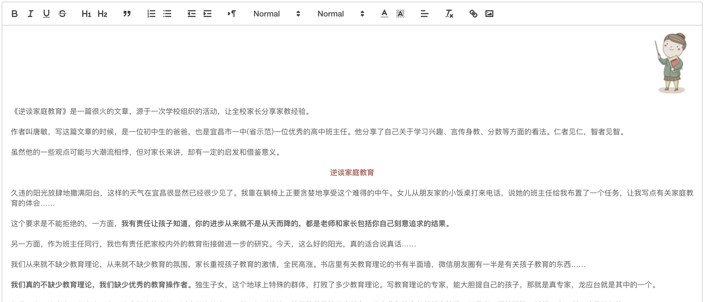
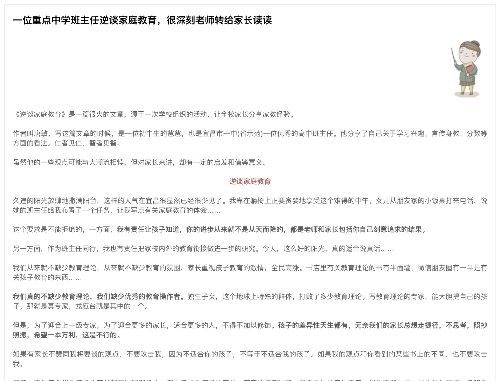
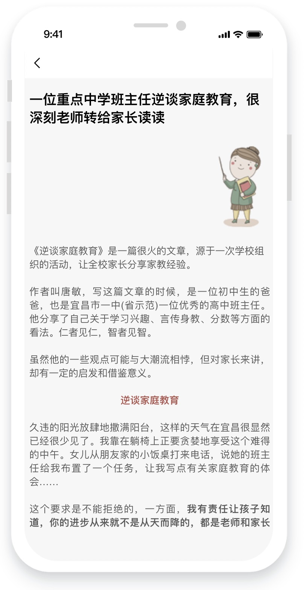

quill富文本编辑器有跨平台、轻量级、易扩展、开源免费等特点,基本满足一般文章编辑的需求,在使用过程中表现良好未发现异常情况.

```
使用方法:
  1.引入如quill
  2.在vue.config.js 中配置
    configureWebpack: {
      plugins: [
        new webpack.ProvidePlugin({
          'window.Quill': 'quill/dist/quill.js',
          'Quill': 'quill/dist/quill.js'
        }),
      ]
    }
  3.
    模版:<div ref="editor" id="editor"></div>
    css:
      @import "~quill/dist/quill.core.css";
      @import '~quill/dist/quill.snow.css';//文章编辑时使用
      @import "~quill/dist/quill.bubble.css";//文章展示时使用
    js:具体看代码
      配置options
      //赋值
      document.querySelector("#editor").innerHTML = newVal;
      //保存时,替换掉webp格式的图片,因为在ios中不显示
      content: self.content.replace(/tp=webp&amp;/g, '').replace(/&amp;tp=webp/g, ''),
      //使用quill-image-resize-module 和 video.js

  不满足需求的地方做了如下改动:
  1.由于quill的默认上传图片的方式为base64,所以修改为上传OSS的方式.
    const toolbar = this.quill.getModule('toolbar');
    toolbar.addHandler('image', () => {});
  2.默认上传的图片不能修改尺寸,故而引入第三方插件quill-image-resize-module来调整上传图片的尺寸
  3.默认引入视频的方式是iframe嵌入方式,此方式存在小程序业务域名问题,所以修改为直接引入video标签.
    import Video from './video';//详细看代码
  4.上传前过滤webp格式的图片,否则在ios中不显示
    self.content.replace(/tp=webp&amp;/g, '').replace(/&amp;tp=webp/g, ''),
  5.解决微信图片无法引用问题
    meta name="referrer" content="never"'
  6.默认文字字号非数字,后续需要修改
  
  编辑器示意图
  
  文章PC示意图
  
  文章Phone示意图
  
```